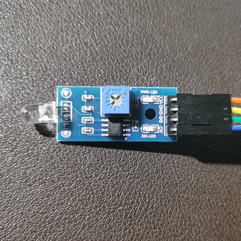

# ESP8266 Light Sensor

## Sensor

Note: 
* Sensitivity adjustor is used to increase the intensity of light.

## Hardware Installation

### ESP-12E

| ESP-12E | Sensor |
| ------- | ------ |
| 3V3     | VCC    |
| GND     | GND    |
| D1      | AO     |
| D2      | DO     |
